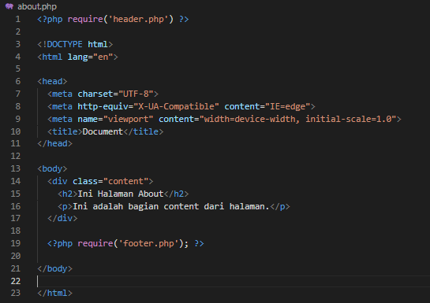
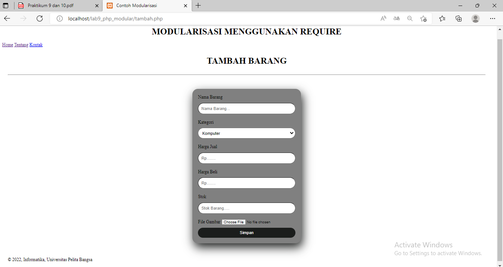
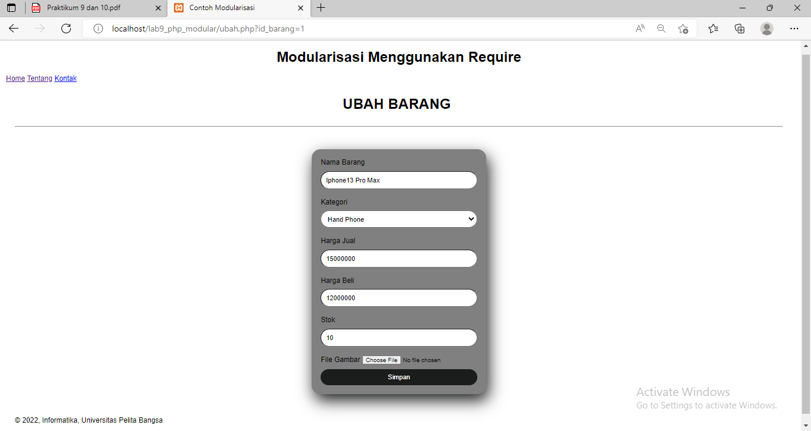

# Link Praktikum 10
https://github.com/fasha-20/Lab10Web

# Lab9_PHP_Modular
## Membuat file header.php

## Membuat file footer.php

## Membuat file home.php

## Membuat file about.php

# Tugas
Implementasikan konsep modularisasi pada kode program praktikum 8 tentang
database, sehingga setiap halamannya memiliki template tampilan yang sama

## Tampilan Index

## Tampilan Tambah

## Tampilan Ubah

